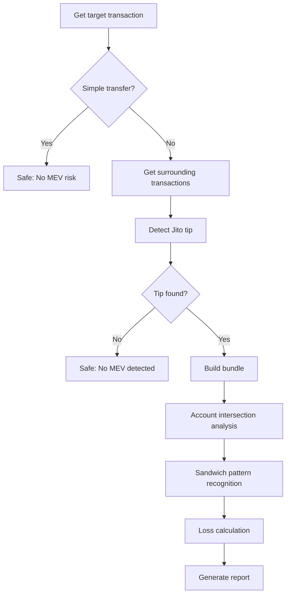

# 🔍 Solana MEV Victim Detector (Liquidation Detector)

- 🛠️ U just need to run `./run.sh` or `sh run.sh` and it will start. 🛠️

## 📦 Supported Platforms

The build script automatically detects your platform and creates optimized binaries for multiple architectures:

### 🐧 Linux Distributions

| Binary                                 | Target                     | Description                                                                                           |
| -------------------------------------- | -------------------------- | ----------------------------------------------------------------------------------------------------- |
| `jito-mev-detector_x86_64-linux-musl`  | x86_64-unknown-linux-musl  | **Universal Linux** - Compatible with most distributions (Ubuntu, Debian, CentOS, Fedora, Arch, etc.) |
| `jito-mev-detector_aarch64-linux-musl` | aarch64-unknown-linux-musl | **ARM 64-bit** - For ARM-based systems (Raspberry Pi 4, ARM servers)                                  |
| `jito-mev-detector_x86_64-linux-glibc` | x86_64-unknown-linux-gnu   | **Modern Linux** - For systems with glibc (Ubuntu 20+, Debian 11+, etc.)                              |

# Our Discord

If you have any questions, please join our Discord: https://discord.gg/uQjDnRhy

# Buy me a coffee

Solana: FBhS1a57H6MnHAVcu3MntF1tj8MkGnrvo7nFWc49rgKE

## ✨ Key Features

### 🎯 **Core Detection Capabilities**

- **🥪 Sandwich Attack Detection** - Intelligent detection based on account intersections and price impact
- **🏃 Front-running Detection** - Identifies front-running patterns in the same liquidity pools
- **💰 Precise Loss Calculation** - 4 advanced algorithms for estimating actual user losses
- **📦 Jito Bundle Analysis** - Automatic identification and parsing of Jito MEV bundles

### 🚀 **Advanced Capabilities**

- **Multi-DEX Support** - Raydium, Orca, Jupiter, Pump.fun and other major DEXes
- **Smart Transaction Recognition** - Identifies unknown DEX programs based on account patterns
- **Efficient Filtering** - Automatically skips simple transfers and voting transactions
- **Real-time Loss Estimation** - Multiple methods for calculating economic losses from MEV attacks

### 💡 **User Experience**

- **Intuitive Output Interface** - Clear detection results and loss reports
- **Continuous Detection Mode** - Supports batch detection without restart
- **Detailed Logging** - Configurable log levels and debug information
- **🆕 Flexible Configuration System** - Customize all detection parameters via TOML configuration file
- **🆕 Hot Parameter Adjustment** - Adjust detection sensitivity and loss calculation parameters without source code modification

## 🛠️ Technology Stack

- **Language**: Rust 2021 Edition (1.70+)
- **Async Runtime**: Tokio
- **HTTP Client**: Reqwest
- **Serialization**: Serde
- **Logging**: env_logger
- **Encoding**: bs58

## 🚀 Quick Start

### Configuration Setup

Create a `config.toml` configuration file:

```toml
# RPC node configuration
rpc_url = "https://mainnet.helius-rpc.com/?api-key=YOUR_API_KEY"

# Log level configuration
log_level = "info"  # Options: error, warn, info, debug, trace

# Optional: Predefined transaction hash list for automatic detection
auto_detect_hashes = [
    "your_transaction_hash_1",
    "your_transaction_hash_2"
]

# MEV detection configuration parameters
[mev_detection]
# Transaction similarity threshold (0.0-1.0, default 0.5 means 50%+ similarity considered same pool)
similarity_threshold = 0.5

# Small transfer threshold (lamports, default 1,000,000 = 0.001 SOL)
small_transfer_threshold = 1000000

# Price impact analysis parameters
[mev_detection.price_impact]
# Price impact ratio coefficient (default 0.01)
price_impact_ratio = 0.01
# Maximum loss percentage limit (default 10.0%)
max_loss_percentage = 10.0

# Token balance change analysis parameters
[mev_detection.token_balance]
# Loss coefficient (default 0.005)
loss_coefficient = 0.005
# Maximum loss percentage limit (default 5.0%)
max_loss_percentage = 5.0

# Slippage estimation parameters
[mev_detection.slippage]
# Base slippage (default 0.001 = 0.1%)
base_slippage = 0.001
# Complexity factor adjustment parameter (default 0.2)
complexity_factor = 0.2
# Instruction factor adjustment parameter (default 0.1)
instruction_factor = 0.1
# Maximum loss percentage limit (default 3.0%)
max_loss_percentage = 3.0

# SOL balance change analysis parameters
[mev_detection.sol_balance]
# Impact factor (default 0.6, meaning 60% impact factor)
impact_factor = 0.6
# Conservative estimation ratio (default 0.3, meaning 30%)
conservative_ratio = 0.3
# Maximum loss percentage limit (default 8.0%)
max_loss_percentage = 8.0

# Trade size estimation parameters
[mev_detection.trade_size]
# Minimum account count for swap transactions (default 6)
min_swap_accounts = 6
# Complexity estimation value per instruction (lamports, default 100,000,000 = 0.1 SOL)
instruction_complexity_value = 100000000
# Estimation value per account (lamports, default 50,000,000 = 0.05 SOL)
account_factor_value = 50000000
# Minimum trade size estimation (lamports, default 100,000,000 = 0.1 SOL)
min_trade_size = 100000000
```

## 📖 Usage Guide

### Interactive Interface

The program displays a user-friendly interface upon startup:

```
============================================================
🔍 Solana MEV Detector v0.2.0
============================================================

Please enter a Solana transaction hash (type 'exit' or 'quit' to exit):
>
```

### Operation Instructions

1. **Single Detection**: Enter transaction hash and press Enter
2. **Batch Detection**: Set `auto_detect_hashes` in configuration file
3. **Exit Program**: Type `exit` or `quit`

### Example Detection Results

#### ✅ Safe Transaction

```
✅ This transaction is a simple transfer, no Swap involved, no MEV risk.
```

#### 🚨 MEV Attack Detected

```
🎯 Detected Jito bundle transaction, analyzing MEV attack...
📍 Jito tip position: Before target transaction
💰 Tip amount: 0.001000 SOL
📦 Bundle contains 5 transactions:
  1. Jito tip transaction ⭐
  2. Other transaction
  3. Target transaction 🎯
  4. Other transaction
  5. Other transaction

🚨 Sandwich attack detected!
  Front-run transaction: https://solscan.io/tx/abc123...
  Back-run transaction: https://solscan.io/tx/def456...
  Shared account count: 4

💸 User loss estimation:
  Loss amount: 0.000150 SOL
  Loss percentage: 2.50%
  MEV profit: 0.000200 SOL
  Calculation method: Price impact analysis

⚠️ Note: Detection results are for reference only, recommend verifying with actual transaction data
```

## 🧮 Loss Calculation Algorithms

### Multi-tier Calculation Methods

We implement 4 advanced loss calculation algorithms, ranked by accuracy:

#### 1. 🎯 **Price Impact Analysis** (Most Accurate)

```rust
Loss = User transaction size × (configured price impact ratio)
```

- Analyzes direct price impact of attackers on pools
- Calculates losses based on actual transaction size
- Accuracy: ⭐⭐⭐⭐⭐
- **Configurable parameters**: `price_impact_ratio`, `max_loss_percentage`

#### 2. 📊 **Token Balance Change Method** (High Accuracy)

```rust
Loss = User size × Relative impact × Market factor × (configured loss coefficient)
```

- Based on relative transaction size and market impact factors
- Considers shared account count and attacker transaction size
- Accuracy: ⭐⭐⭐⭐
- **Configurable parameters**: `loss_coefficient`, `max_loss_percentage`

#### 3. 💹 **SOL Balance Analysis** (Medium Accuracy)

```rust
Loss = MEV profit × (User size/Total size) × (configured impact factor)
```

- Improved algorithm based on transaction size ratio
- Considers user's proportion in total transaction volume
- Accuracy: ⭐⭐⭐
- **Configurable parameters**: `impact_factor`, `conservative_ratio`, `max_loss_percentage`

#### 4. 📉 **Slippage Estimation** (Fallback Method)

```rust
Loss = Transaction size × (configured base slippage × dynamic adjustment factor)
```

- Based on transaction complexity and market depth
- Dynamically calculates slippage rate
- Accuracy: ⭐⭐
- **Configurable parameters**: `base_slippage`, `complexity_factor`, `instruction_factor`, `max_loss_percentage`

### Algorithm Advantages

- **Smart Degradation**: Prioritizes most accurate method, automatically falls back on failure
- **Flexible Configuration**: All detection parameters and loss calculation coefficients adjustable via config file
- **Loss Caps**: Each method has configurable reasonable loss limits for protection
- **Real-world Validation**: Calibrated based on actual MEV attack data, supports user-defined tuning
- **Personalized Adjustment**: Users can adjust detection sensitivity and loss estimation conservatism based on risk preferences

## 🔍 Detection Algorithms

### Sandwich Attack Detection Flow



### Core Detection Logic

#### 🔍 **Account Intersection Analysis**

- Extract all writable accounts from transactions
- Filter system accounts and small transfers
- Calculate account overlap between front and back transactions

#### 🎯 **Sandwich Pattern Recognition**

- Front-run transaction → Target transaction → Back-run transaction
- Account intersection similarity ≥ configured similarity threshold (default 50%)
- Same signer identifies attacker
- **Configurable**: Adjust detection sensitivity via `similarity_threshold`

#### 🏃 **Front-running Detection**

- Detect account overlap between front-run and target transactions
- Verify transaction time windows
- Analyze transaction complexity patterns

### Supported DEX Ecosystem

| DEX             | Program ID      | Support Status       |
| --------------- | --------------- | -------------------- |
| Raydium AMM     | `675kPX9MH...`  | ✅ Fully Supported   |
| Raydium CLMM    | `CAMMCzo5YL...` | ✅ Fully Supported   |
| Orca Whirlpools | `whirLbMiic...` | ✅ Fully Supported   |
| Orca V1         | `9WzDXwBbmk...` | ✅ Fully Supported   |
| Jupiter         | `JUP6LkbZbj...` | ✅ Fully Supported   |
| Pump.fun        | `6EF8rrecth...` | ✅ Fully Supported   |
| Serum DEX       | `9xQeWvG816...` | ✅ Fully Supported   |
| Unknown DEX     | -               | ✅ Smart Recognition |

## ⚙️ Configuration Options

### Basic Configuration

```toml
# Required configuration
rpc_url = "https://your-rpc-endpoint.com"

# Optional configuration
log_level = "info"           # Log level
auto_detect_hashes = []      # Automatic detection transaction list
```

### Advanced MEV Detection Configuration

#### 🎯 **Similarity Configuration**

```toml
[mev_detection]
# Transaction similarity threshold - controls sandwich attack detection sensitivity
similarity_threshold = 0.5    # 0.0-1.0, default 0.5 (50%)

# Small transfer filtering threshold - filters out small transfers to reduce false positives
small_transfer_threshold = 1000000  # lamports (0.001 SOL)
```

#### 💰 **Loss Calculation Configuration**

**Price Impact Analysis Parameters** (Most precise method)

```toml
[mev_detection.price_impact]
price_impact_ratio = 0.01        # Price impact coefficient (1%)
max_loss_percentage = 10.0       # Maximum loss limit (10%)
```

**Token Balance Change Analysis Parameters**

```toml
[mev_detection.token_balance]
loss_coefficient = 0.005         # Loss calculation coefficient (0.5%)
max_loss_percentage = 5.0        # Maximum loss limit (5%)
```

**Slippage Estimation Parameters** (Fallback method)

```toml
[mev_detection.slippage]
base_slippage = 0.001           # Base slippage (0.1%)
complexity_factor = 0.2         # Complexity adjustment factor
instruction_factor = 0.1        # Instruction count adjustment factor
max_loss_percentage = 3.0       # Maximum loss limit (3%)
```

**SOL Balance Change Analysis Parameters**

```toml
[mev_detection.sol_balance]
impact_factor = 0.6             # Impact factor (60%)
conservative_ratio = 0.3        # Conservative estimation ratio (30%)
max_loss_percentage = 8.0       # Maximum loss limit (8%)
```

#### 📊 **Trade Size Estimation Configuration**

```toml
[mev_detection.trade_size]
min_swap_accounts = 6                    # Minimum account count to identify swap
instruction_complexity_value = 100000000 # Value per instruction (0.1 SOL)
account_factor_value = 50000000          # Value per account (0.05 SOL)
min_trade_size = 100000000              # Minimum trade size (0.1 SOL)
```

### Configuration Tuning Guide

#### 🔧 **Increase Detection Sensitivity**

```toml
# Easier to detect MEV attacks, but may increase false positives
similarity_threshold = 0.3        # Lower similarity requirement
small_transfer_threshold = 500000  # Lower small transfer threshold
```

#### 🎯 **Reduce False Positive Rate**

```toml
# Stricter detection conditions, reduces false positives but may miss some attacks
similarity_threshold = 0.7        # Higher similarity requirement
min_swap_accounts = 8            # Higher swap recognition threshold
```

#### 💡 **Economic Loss Sensitivity Adjustment**

```toml
# Adjust sensitivity of various loss calculation methods
[mev_detection.price_impact]
price_impact_ratio = 0.005       # Lower price impact sensitivity

[mev_detection.token_balance]
loss_coefficient = 0.003         # More conservative loss estimation
```

### Log Level Description

| Level   | Description         | Use Case               |
| ------- | ------------------- | ---------------------- |
| `error` | Error messages only | Production environment |
| `warn`  | Warnings and errors | Production environment |
| `info`  | Basic information   | **Recommended**        |
| `debug` | Detailed debugging  | Development debugging  |
| `trace` | All information     | Deep debugging         |

## 🚀 Performance Optimization

### Intelligent Filtering Mechanism

- ⚡ **Pre-check Optimization**: Account list verification before instruction parsing
- 🔄 **Voting Transaction Filtering**: Automatically skips Solana network voting transactions
- 🎯 **Early Exit**: Quick identification of transactions with no MEV risk

### Efficient Data Processing

- 📊 **Minimized RPC Calls**: Smart caching and batch requests
- 💾 **Memory Optimization**: Timely release of unnecessary transaction data
- 🔒 **Concurrency Safety**: Supports multi-threaded safe data access

### Detection Precision Control

- 🎛️ **Multi-layer Validation**: Multiple validations of program ID, account lists, and instruction data
- 🚫 **False Positive Control**: Reduces false positives through multiple characteristics
- 🌐 **Comprehensive Coverage**: Supports detection of known and unknown DEXes

## 🚀 Version Updates

### v0.2.0 - Configuration System Overhaul

- ✨ Added complete TOML configuration file support
- 🔧 All MEV detection parameters now adjustable via configuration file
- 📊 Support for independent parameter configuration of 4 loss calculation algorithms
- ⚡ Users can customize detection sensitivity based on needs
- 🎯 Added configuration tuning guide and best practice recommendations

---
